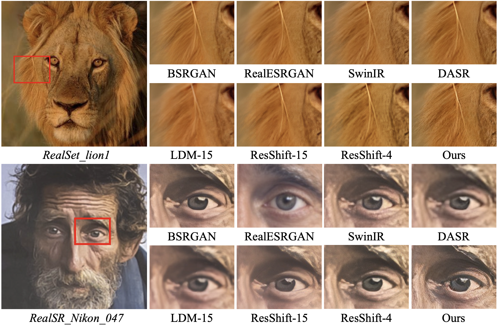

# UPSR

This repository is an official implementation of the paper "Uncertainty-guided Perturbation for Image Super-Resolution Diffusion Model", CVPR, 2025.

[[arXiv](https://arxiv.org/abs/2503.18512)] [[Pretrained Models (coming soon)](https://drive.google.com/drive/folders/1Rde_8kTeNEA4kjUqCv2tiXV0vmmVCKGR?usp=sharing)]

By [Leheng Zhang](https://scholar.google.com/citations?user=DH1CJqkAAAAJ), 
[Weiyi You](), [Kexuan Shi](https://scholar.google.com/citations?user=dX-aOIwAAAAJ), and [Shuhang Gu](https://scholar.google.com/citations?user=-kSTt40AAAAJ).

> **Abstract:** 
Diffusion-based image super-resolution methods have demonstrated significant advantages over GAN-based approaches, particularly in terms of perceptual quality. 
Building upon a lengthy Markov chain, diffusion-based methods possess remarkable modeling capacity, enabling them to achieve outstanding performance in real-world scenarios.
Unlike previous methods that focus on modifying the noise schedule or sampling process to enhance performance, our approach emphasizes the improved utilization of LR information.
We find that different regions of the LR image can be viewed as corresponding to different timesteps in a diffusion process, where flat areas are closer to the target HR distribution but edge and texture regions are farther away. 
In these flat areas, applying a slight noise is more advantageous for the reconstruction.
We associate this characteristic with uncertainty and propose to apply uncertainty estimate to guide region-specific noise level control, a technique we refer to as Uncertainty-guided Noise Weighting.
Pixels with lower uncertainty (i.e., flat regions) receive reduced noise to preserve more LR information, therefore improving performance.
Furthermore, we modify the network architecture of previous methods to develop our **U**ncertainty-guided **P**erturbation **S**uper-**R**esolution (**UPSR**) model.
Extensive experimental results demonstrate that, despite reduced model size and training overhead, the proposed UPSR method outperforms current state-of-the-art methods across various datasets, both quantitatively and qualitatively.
>


## Contents
1. [Enviroment](#environment)
1. [Training](#training)
1. [Testing](#testing)
1. [Visual Results](#visual-results)
1. [Citation](#citation)
1. [Acknowledgements](#acknowledgements)


## Environment
- Python 3.10
- PyTorch 2.4.1

### Installation
```bash
git clone https://github.com/LabShuHangGU/UPSR.git

conda create -n UPSR python=3.10
conda activate UPSR

pip install -r requirements.txt
python setup.py develop
```


## Training
### Data Preparation
- Download the training dataset [ImageNet](https://data.vision.ee.ethz.ch/cvl/DIV2K/) and put them in the folder `./datasets`.

### Training Commands
- Refer to the training configuration files in `./options/train` folder for detailed settings.
```bash
# batch size = 2 (GPUs) × 16 (per GPU)

CUDA_VISIBLE_DEVICES=0,1 python -m torch.distributed.launch --use-env --nproc_per_node=2 --master_port=1145  train.py -opt options/000_UPSR_RealSR_x4.yml --launcher pytorch
```


## Testing
### Data Preparation
- Download and generate the testing data ([ImageNet-Test](https://github.com/zsyOAOA/ResShift/tree/journal) + [RealSR](https://github.com/csjcai/RealSR) + [RealSet65](https://github.com/zsyOAOA/ResShift/tree/journal)) and put them in the folder `./datasets`.

### Pretrained Models
- Download the [pretrained models](https://drive.google.com/drive/folders/1Rde_8kTeNEA4kjUqCv2tiXV0vmmVCKGR?usp=sharing) and put them in the folder `./experiments/pretrained_models`.

### Testing Commands
- Refer to the testing configuration files in `./options/test` folder for detailed settings.
```bash
CUDA_VISIBLE_DEVICES=0 python test.py -opt options/001_UPSR_RealSR_x4.yml
```


## Visual Results




## Citation

```
@article{zhang2025uncertainty,
  title={Uncertainty-guided Perturbation for Image Super-Resolution Diffusion Model},
  author={Zhang, Leheng and You, Weiyi and Shi, Kexuan and Gu, Shuhang},
  journal={arXiv preprint arXiv:2503.18512},
  year={2025}
}
```

## Acknowledgements
This code is built on [BasicSR](https://github.com/XPixelGroup/BasicSR) and [ResShift](https://github.com/zsyOAOA/ResShift/tree/journal).

